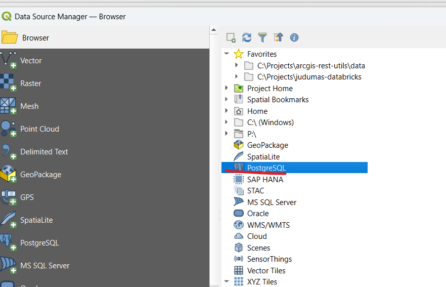
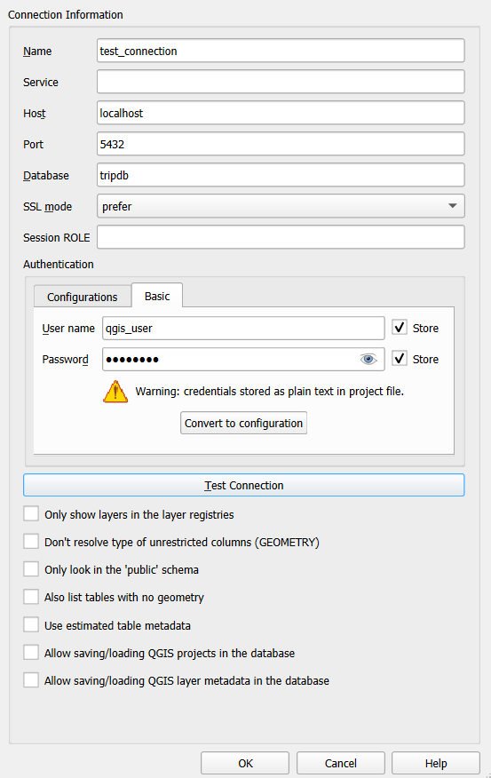
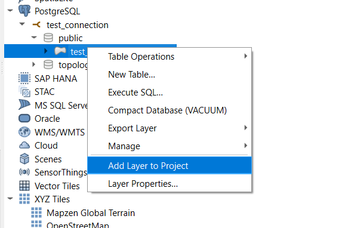
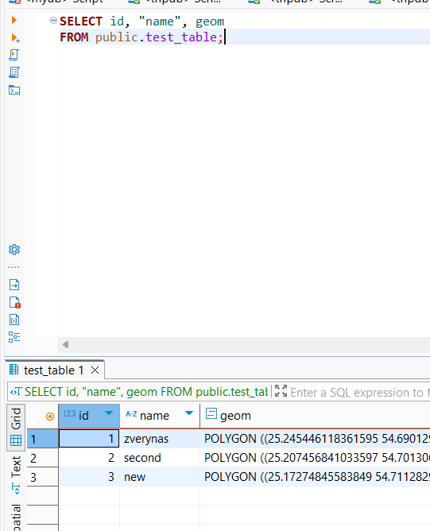

# GIS interaction

1. Creating a new user if needed to interact with the database:
   ```sql
   CREATE USER qgis_user WITH PASSWORD 'your_password';
   ```
2. Granting the necessary privileges to the user:
   ```sql
   GRANT INSERT, UPDATE, DELETE ON test_table TO qgis_user;
   ```
3. Connecting to the database using the new user:
    ```sql
   GRANT SELECT ON test_table TO qgis_user;
   GRANT USAGE, SELECT ON SEQUENCE test_table_id_seq TO qgis_user;

   ```
4. Opening QGIS and adding a new PostGIS connection:
   - Go to **Layer** > **Data Source Manager** > **PostreSQL**.
    
    - Fill in the connection details:
      - **Name**: A name for your connection.
      - **Host**: The hostname of your PostgreSQL server.
      - **Port**: The port number (default is 5432).
      - **Database**: The name of your database.
      - **Username**: `qgis_user`.
      - **Password**: The password you set for `qgis_user`.

    

5. Add layer to the project:

   

6. Test if edit is possible:
   

7. In SQL client check if the data is updated:
   ```sql
   SELECT * FROM test_table;
   ```
   